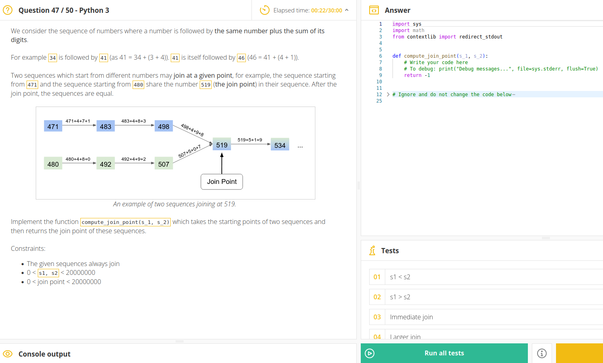

# Coding test python

## Question 1
`function` must return true if x or y equals 1 and if the sum of x and y equals to 1.

```python
def function_test(x, y):
    if x + y == 1:
        return True

    if x == 1 or y == 1:
        return True
    
    return False

print(f"(1,0), expected:True, actual:{function_test(1,0)}")
print(f"(0,1), expected:True, actual:{function_test(0,1)}")
print(f"(3,1), expected:True, actual:{function_test(3,1)}")
print(f"(1,10), expected:True, actual:{function_test(1,10)}")

print(f"(2.1,10), expected:False, actual:{function_test(2.1,10)}")
print(f"(1.1,10), expected:False, actual:{function_test(1.1,10)}")
print(f"(1.000,10), expected:True, actual:{function_test(1.000,10)}")
print(f"(0.5,0.5), expected:True, actual:{function_test(0.5,0.5)}")
print(f"(0.12,0.88), expected:True, actual:{function_test(0.12,0.88)}")
print(f"(0.011,0.989), expected:True, actual:{function_test(0.011,0.989)}")
```

## Calculate PI number with a square and a circle
```python
import random
from math import hypot

def estimate_pi(n):
    in_circle_count = 0
    in_square_count = 0

    for _ in range(n):
        x = random.uniform(0,1)
        y = random.uniform(0,1)

        distance = hypot(x, y)
        if distance <= 1:
            in_circle_count += 1
        
        in_square_count += 1
    
    return 4 * in_circle_count / in_square_count

[print(estimate_pi(pow(10,i))) for i in range(8)]
```

$$
{ S_{square} \over S_{circle} } = { 4 r^2 \over \pi r^2 }
$$
$$
{ \pi } = 4 { S_{circle} \over S_{square}  }
$$

* https://www.youtube.com/watch?v=pvimAM_SLic

## Add element to a set
```python
set_1 = {1, 2, 3, "toto"}
set_1.add(1.2)
```

## And operator with boolean
```python
is_ok = True
is_nice = False
if is_ok and is_nice:
    print("Let's go")
```

## Check if array is empty
```python
l = []

if l:
    print("list has items")

if not l:
    print("list is empty")
```

## Static method
```python
class MyClass(object):
    @staticmethod
    def the_static_method(x):
        print(x)

MyClass.the_static_method(2)  # outputs 2
```
Use staticmethod() sparingly! There are very few situations where static-methods are necessary in Python, and I've seen them used many times where a separate "top-level" function would have been clearer.

## Comment est gérée la mémoire

## Quelle est la différence entre une interface et une classe abstraite

## Quel design patern connaissez vous ?

## ASCII characters
```python
ord('H')
# => 72
chr(72)
# => 'H'

import string
string.ascii_uppercase
# => 'ABCDEFGHIJKLMNOPQRSTUVWXYZ'
```

## Replace space by '\n' without using '\n'
```python
from os import linesep
test_string = "coucou comment ça va"
test_string.replace(' ' , linesep)

# OR
ord('\n')
# => 10
chr(10)
```

## GroupBy with numpy
```python
np.unique(list, return_counts=True)
```

## Slicing
```python
l = [0, 1, 2, 3, 4, 5, 6]
l[5:3:-1] # ?
```

## Search key in dict
```python
'a' in x
```

## Search file recursively
```python
from pathlib import Path
file_path = next(Path(root).rglob(file_name))
```

## Joint point


```python
import math

def get_digits(number):
    digit_count = int(math.log(number))
    for digit_index in range(digit_count):
        digit, _ = math.modf(number / math.pow(10, digit_index + 1))
        number -= digit * math.pow(10, digit_index + 1)
        yield number


def compute_join_point(s_1, s_2):
    # Write your code here
    # To debug: print("Debug messages...", file=sys.stderr, flush=True)

    while s_1 != s_2:
        s_1 += sum(list(get_digits(s_1)))
        s_2 += sum(list(get_digits(s_2)))

    return s_1

# compute_join_point(471, 480)
```

# Python

## Tips
### Reverse a list
```python
list(range(10))[::-1]
```

### Slicing
The syntax `[x:y:z]` means "take every `z`th element of a list from index `x` to index `y`". When `z` is negative, it indicates going backwards. When `x` isn't specified, it defaults to the first element of the list in the direction you are traversing the list. When `y` isn't specified, it defaults to the last element of the list. So if we want to take every 2th element of a list, we use `[::2]`.

### Insertion
```python
elems = list(range(10))
elems[:0] = [-3, -2, -1]

==> [-3, -2, -1, 0, 1, 2, 3, 4, 5, 6, 7, 8, 9]
```

### Flattening
```python
list_of_lists = [[1], [2, 3], [4, 5, 6]]
sum(list_of_lists, [])

==> [1, 2, 3, 4, 5, 6]
```

```python
nested_lists = [[1, 2], [[3, 4], [5, 6], [[7, 8], [9, 10], [[11, [12, 13]]]]]]
flatten = lambda x: [y for l in x for y in flatten(l)] if type(x) is list else [x]
flatten(nested_lists)
```

```python
A, B, C, D = [0], [4,5], [6], [5,6,1,0]
L = [A, B, C, D]
flat = [x for SL in L for x in SL]
```

### List vs generator
https://github.com/chiphuyen/python-is-cool#25-list-vs-generator

```python
def ngrams(tokens, n):
    length = len(tokens)
    grams = []
    for i in range(length - n + 1):
        grams.append(tokens[i:i+n])
    return grams

def ngrams(tokens, n):
    length = len(tokens)
    for i in range(length - n + 1):
        yield tokens[i:i+n]

def ngrams(tokens, n):
    length = len(tokens)
    slices = (tokens[i:length-n+i+1] for i in range(n))
    return zip(*slices)
```

### Format string
```python
strings = [f"value: {value}"]
strings.append(f"left: {left}" if left else "left: None")
return ', '.join(strings)
```

### Time lapse decorator
```python
def timeit(fn): 
    # *args and **kwargs are to support positional and named arguments of fn
    def get_time(*args, **kwargs): 
        start = time.time() 
        output = fn(*args, **kwargs)
        print(f"Time taken in {fn.__name__}: {time.time() - start:.7f}")
        return output  # make sure that the decorator returns the output of fn
    return get_time
```

### Caching with @functools.lru_cache
Memoization is a form of cache: we cache the previously calculated ...

```python
import functools

@functools.lru_cache()
def fib_helper(n):
    if n < 2:
        return n
    return fib_helper(n - 1) + fib_helper(n - 2)
```

### Recursion with Fibonacci serie
```python
def fib_helper(n):
    if n < 2:
        return n
    return fib_helper(n - 1) + fib_helper(n - 2)

def fib_m_helper(n, computed):
    if n in computed:
        return computed[n]
    computed[n] = fib_m_helper(n - 1, computed) + fib_m_helper(n - 2, computed)
    return computed[n]
```

## Generator
Generate infinite squarred
```python
def g():
    k = 0
    while True:
        yield k**2
        k += 1
```

## Deprecated `filter`
```python
def f(x):
    return x > 100

L = [10,111]
F = filter(f, L)
```

## Deprecated `map`
```python
def f(x):
    return x**2

L = [10,111]
F = map(f, L)
```

## Tuple
```python
S = {0,1,2,3,4}
Y = (x*x for x in S)
next(Y)
```

### Named Tuple
```python
from collections import namedtuple
pt = namedtyple("Point", ["x", "y"])
M = pt(4,-5) # unmutable => M[0] = 4 => AttributeError
```

## Unpack iterable with *

## Unpack dictionary with **
```python
def f(**kwargs):
    ...
```
kwargs => keyword arguments

## TDD in python
```python
def produit(a,b):
    """
        a, b product
        :Sample:
        >>> produit(2,3)
        6
        >>> produit(2.3,3.1)
        7.13
    """
    return a*b
```

test
```python
import doctest
doctest.testmod()
```

## File management
```python
from os import listdir
from os.path import join, isfile
files = listdir("Algebre")
resultat = []
for file_path in files:
    path = join("Algebre", file_path)
    if isfile(path):
        resultat = resultat + [file_path]
```

**get current directory**
```python
from os import getcwd, chdir
getcwd()
chdir("") # change current directory
```
```python
f = open("filepath.txt", "r") # => TextIoWrapper

f = open("filepath.txt", "rb") # => BufferedReader

f = open("filepath.txt", "w") # => mode write

f = open("filepath.txt", "a") # => write append mode

t = f.read()
f.close()

f.seek() # déplace la tete de lecture
f.readline()
```

## Pickle
```python
from pickle import *
object_to_save = [1,2, "SS"]
f = open("file_path.bin", "wb")
dump(object_to_save,f)
f.close()

# reopen and..
loaded_object = load(f)
```

## Iterable types
* str
* bytes
* bytearray (mutable)
* list (mutable)
* tuple
* range
* dict (mutable)
* set (mutable)
* frozenset (unmutable)
* fileobject
* generator

## Mutable types
* dict
* list
* bytearray
* set => {1,2,3}

python works with identifiers not with variables

if U is L and U, L mutables then point to the same data.

## Local, Global, Interns
```python
globals()
locals()
```

## Set and FrozenSet
### special methods
* discard(): remove
* update(): concat

## Dict
each key must be hashable, i.e. data that are **not** mutable
### special methods
* keys()
* values()
* items()

Get without index error
```python
dico.get(3, "default value")
```

## with
```python
class context(object):
    def __init__(self, a="Before", b="After"):
        self.before = a
        self.after = b
    
    def __enter__(self):
        print(self.before)
    
    def __exit__(self, type, value, traceback):
        print(self.after)

```

## Boolean operator
```python
x = True
not(x) == not x

all([True, False])

y = False
x or y

# xor
x ^ y
```

## Sorting
```python
L = [56, 23, 897]
sorted(L, reverse=False) # list creation
L.sort(L, reverse=False) # same list == mutation

reversed(L)
L.reverse() # mutation
```

## Delete item from index
```python
L = [56, 12, 31, 45]
del(L[2]) # mutation
del(L[2:]) # mutation
L.remove(56) # mutation, delete only first occurence
```


## Dates
```python
from datetime import datetime
d = datetime(1971,4,18,2,25,00)
"{:%Y-%m-%d %H:%M:%S}".format(d)
```

## Code analyzer in python

## Run interactively pyton console
```python
python -i main.py
```

## PDB: python debugger
```python
import pdb
pdb.set_trace()
```

## Dependency management: virtual environment
pip virtualenv

## List comprehension
```python
toto = [fruit["name"] for fruit in fruits if fruit["name"] == "toto"]
```
## Dictionary comprehension
```python
dicto = {fruit['name']: fruit['price'] for fruit in fruits}
```

## str() VS repr()
```python
print(x)    # displays str(), for users
x           # displays repr(), for programers
```

## Float Int
```python
0 == 0.0
# => True
0 is 0.0
# => False
```

## Binary
```python
x = 0b1010110 # prefix "0b" or "OB"
bin(3)
```
## Hexadecimal
```python
x = 0x4af641 # prefix "0x" or "0X"
hex(10)
```

## NaN and Infinity
```python
float("nan")
float("-inf")
float("inf")
```

```python
from math import isinf, isnan
```

## Random choise
```python
from random import *
sample(range(20), 3) # 3 random numbers among range(20)
choice(range(20))
gauss(1,2) # gauss(mean, standard deviation)
```

## Try, Except, Else, Finally
```python
def(name):
    try:
        f = open(name, "r")
    except ZeroDivisionError:
        print("division error")
    except (AttributeError, LookupError):
        print("reference error")
    except:
        print("This file", name, "does not exist")
    else:
        ch = f.readline()
        print(ch)
    finally:
        f.close()
        print("close stream")
```

Throw an exception
```python
raise ArithmeticError("Error")
```

## Assert
```python
assert 5 > 6
# raise AssertionError
```

## Exception
BaseException is the base class for all exceptions
```python
issubclass(ZeroDivisionError, ArithmeticError)
issubclass(ArithmeticError, Exception)
issubclass(Exception, BaseException)
```

## Typage dynamique = duck typing


# Questions d'entretien en Python


## Expliquez brièvement le processus d'exécution d'un fichier Python ?

Python est un langage interprété. L'interpréteur Python, en coulisse, convertit votre code source en bytecode (fichiers .pyc), puis les exécute pour vous.

## Nous savons que Python est un langage orienté objet, mais a-t-il des spécificateurs d'accès ?

Non. Python est un langage moderne orienté objet qui considère l'utilisation de spécificateurs d'accès (par exemple, privé et public en C++) comme dépassée et redondante.

## Comment fonctionne l'opérateur ternaire en Python ? Peut-on assigner une valeur à une variable à l'intérieur d'un opérateur ternaire ?

L'ordre des arguments dans l'opérateur ternaire de Python est différent de celui de la plupart des langages, où l'on écrit d'abord la condition, puis les deux expressions. En Python, il faut l'écrire : A si condition sinon B.

L'exécution est court-circuitée de telle sorte que seul A est évalué si la condition est vraie, et seul B est exécuté, au cas où elle serait fausse.

Pour la deuxième partie : Non, les affectations ou les déclarations (par exemple : pass) ne peuvent pas être utilisées au sein d'un opérateur ternaire.

## Pouvez-vous expliquer comment une exception peut être attrapée dans un programme Python ?

En entourant votre code entre les mots-clés try et except . Vous pouvez soit utiliser les exceptions intégrées de Python, soit définir une nouvelle classe d'exception. Vous pouvez également soulever une exception dans un cas spécifique en utilisant le mot-clé raise .

## Comment testeriez-vous un code Python ?

`unittest` et `Doctest` qui sont fournis avec la bibliothèque standard de Python. 
`py.test`, `Hypothesis`, `mock`, `tox` et `Unittest2`.

## Que sont les blocs Python et comment les définir ?

Le code source Python est organisé en définissant des blocs par indentation. Les blocs peuvent contenir des blocs et peuvent eux-mêmes faire partie de blocs plus importants.

## Si vous devez choisir entre une liste, un ensemble et un dictionnaire pour stocker 10 millions d'entiers, qu'allez-vous utiliser ? N'oubliez pas que vous souhaiterez plus tard interroger la fréquence d'un nombre dans l'ensemble de données.  

Comme nous devons tenir compte des occurrences multiples d'un nombre, nous ne pouvons pas choisir un ensemble, car il ne stocke pas les doublons par conception.

Pour trouver la fréquence d'un numéro dans une liste, vous devrez l'itérer complètement, ce qui rendra la recherche O(n) complexe et inefficace.

Un dictionnaire vous permet cependant de stocker des paires clé-valeur. Vous pouvez enregistrer un nombre comme clé et le nombre de fois qu'il a été enregistré comme valeur. De cette façon, chaque fois que vous voulez interroger la fréquence, vous pouvez obtenir le résultat dans O(1). Un dictionnaire est donc le meilleur choix dans ce cas particulier.

## Veuillez énumérer quelques différences entre les listes et les tuples en Python.

Les listes Python sont mutables, tandis que les Tuples ne peuvent pas être éditées.

Les tuples peuvent être définis avec une liste d'entiers séparés par des virgules, avec ou sans parenthèses. D'autre part, les listes sont définies par des crochets ou en utilisant le constructeur de liste.

## Quand devez-vous utiliser la copie superficielle au lieu de la copie profonde, et vice versa ?

Lorsque vous faites une copie superficielle, un nouvel objet est créé et il conserve les pointeurs de référence de l'objet original. Comme le processus de copie superficielle n'est pas récursif, les copies des objets enfants originaux ne sont pas créées. En gros, vous avez donc deux objets qui partagent le même ensemble d'éléments. Cela signifie que toute modification apportée à l'objet copié se reflète instantanément dans l'objet original.

Dans le cas d'une copie profonde, cependant, un processus de copie récursif est effectué, et des copies de tous les objets enfants sont créées. Ainsi, si vous apportez une modification à l'objet copié, elle ne se reflétera pas dans l'objet original.

Le moment et la raison pour lesquels vous devriez choisir l'un ou l'autre dépendent du cas d'utilisation, mais il est primordial que vous compreniez le fonctionnement interne des deux processus.

## Qu'est-ce qu'une compréhension de liste et pourquoi l'utiliser, le cas échéant ?

La compréhension des listes est un excellent moyen de définir des listes où chaque élément résulte en fait d'une opération effectuée sur chaque élément d'une autre liste ou d'une séquence. Par exemple, si vous voulez stocker une liste de carrés des 10 premiers nombres premiers, vous pouvez utiliser la compréhension de liste pour le faire. Cependant, la compréhension de liste ne doit pas être utilisée pour des itérations triviales comme l'impression de valeurs, etc. Ne les utilisez que si vous voulez construire une liste résultante qui contient les valeurs mises à jour.

##  Que savez-vous du verrouillage global de l'interpréteur ?

Le `Global Interpreter Lock`, alias `GIL`, est un **mutex** qui empêche plusieurs threads d'exécuter simultanément le **bytecode** Python. Ce verrou est nécessaire parce que la gestion de la mémoire dans CPython n'est pas sûre pour les threads. Cela peut empêcher les applications multi-threads d'utiliser plusieurs CPU et constitue donc un goulot d'étranglement. Cependant, toutes les opérations ne sont pas concernées par le GIL, comme les opérations d'entrée/sortie ou certains calculs effectués dans les bibliothèques (par exemple numpy).

## Is None ou == None, que devez-vous utiliser et pourquoi ? Y a-t-il une différence entre les opérateurs == et is?

Oui, il y a une différence entre == et est. Le premier vérifie l'équivalence et le second vérifie si les deux objets spécifiés sont effectivement identiques.

Cela étant dit, dans le cas de None, il n'y a pas de différence entre les deux. Pourquoi ? Parce qu'il n'y a qu'un seul objet `None`.

En règle générale, il faut utiliser la méthode "Is None".

## Quelle serait la sortie de ce code ?
```python
def f(a,list=[]):
    for i in range(a):
        list.append(i*i)
    print(list) 
 
f(3)
f(2,[1,2,3])
f(2) 
```

[0, 1, 4] [1,2,3,0,1] [0, 1, 4, 0,1]

L'élément clé à retenir ici est que l'objet liste n'est créé qu'une fois, lorsque la fonction est définie. Au premier et au troisième appel, l'objet liste est le même. Cependant, lors du deuxième appel, nous avons utilisé un autre objet pour l'argument liste.

## Dans une fonction, quelle est la signification de *args et **kwargs ?

L'astérisque *args est utilisé dans la définition d'une fonction lorsque vous n'êtes pas sûr·e du nombre d'arguments que vous pourriez avoir à passer à une certaine fonction.

Le double astérisque **kwargs vous permet d'envoyer des arguments chiffrés à une fonction, qui peut contenir autant d'arguments que vous le souhaitez.

##  Quelle serait la sortie de ce code ?

```python
list = ['1', ‘2', '3', '4', '5']
print (list[12:]) 
```

Le résultat serait [] et non une erreur d'index. Cela est dû au fait que nous essayons de récupérer la tranche et que nous ne spécifions que l'index de départ.

## Veuillez indiquer quelques différences entre Python 2.x et 3.x ?

Voici les plus connus :

* Modification de la syntaxe d'impression.
* Modification du comportement de la division des nombres entiers. Par exemple, 3/2 = 1 en Python 2 contre 1,5 en Python 3.
* Introduction de l'Unicode et des classes à deux octets.
* Une nouvelle méthode "__contient__" pour l'objet de portée, qui permet de fixer le processus de recherche.
* Application de la nouvelle syntaxe pour soulever les exceptions ; c'est-à-dire que vous obtiendrez une erreur si vous n'entourez pas l'argument de l'exception de parenthèses.
* Dépréciation de la méthode .next(). Seule la fonction next reste.
* Une erreur de type est maintenant soulevée à juste titre chaque fois que deux types non ordonnés sont comparés.


## Quelles sont les raisons de ne pas aimer Python ?

Cette question est importante car elle fait réfléchir le/la candidat·e. Il n'y a pas d'unanimité concernant les réponses, mais un développeur Python expérimenté et impartial aura toujours quelque chose à dire. Si jamais Python ne plaît réellement pas à une personne, elle pourra vous expliquer avec véhémence ce qu'elle n'aime pas (ou comprendre ce que certaines personnes n'aiment pas) à propos du langage.

* La compatibilité avec Python 2 est un problème, alors que la version 3 a été publiée il y a plus de 10 ans
* L'utilisation de l'espace pour définir les blocs
* Dactylographie dynamique
* The Global Interpreter Lock (GIL). CPython (the most common Python implementation) is not fully thread safe. In order to support multi-threaded Python programs, CPython provides a global lock that must be held by the current thread before it can safely access Python objects. As a result, no matter how many threads or processors are present, only one thread is ever being executed at any given time. In comparison, it is worth noting that the PyPy implementation discussed earlier in this article provides a stackless mode that supports micro-threads for massive concurrency.
* Execution speed. Python can be slower than compiled languages since it is interpreted. (Well, sort of. See our earlier discussion on this topic.)


## Python Google's naming convention
 
module_name, package_name, ClassName, method_name, ExceptionName, function_name, GLOBAL_CONSTANT_NAME, global_var_name, instance_var_name, function_parameter_name, local_var_name

**Sources**
* https://google.github.io/styleguide/pyguide.html
* https://www.python.org/dev/peps/pep-0008/


## Name some characteristics of Python?

* Python is an interpreted language. That means that, unlike languages like C and its variants, Python does not need to be compiled before it is run. Other interpreted languages include PHP and Ruby.
* Python is dynamically typed, this means that you don't need to state the types of variables when you declare them or anything like that. You can do things like x=111 and then x="I'm a string" without error
* Python is well suited to object orientated programming in that it allows the definition of classes along with composition and inheritance. Python does not have access specifiers (like C++'s public, private), the justification for this point is given as "we are all adults here"
* In Python, functions are first-class objects. This means that they can be assigned to variables, returned from other functions and passed into functions. Classes are also first class objects
* Writing Python code is quick but running it is often slower than compiled languages. Fortunately, Python allows the inclusion of C based extensions so bottlenecks can be optimised away and often are. The numpy package is a good example of this, it's really quite quick because a lot of the number crunching it does isn't actually done by Python

## How do I modify a string?

You can’t, because strings are immutable. In most situations, you should simply construct a new string from the various parts you want to assemble it from.

## What are the built-in types available In Python?

* Immutable built-in datatypes of Python
  * Numbers
  * Strings
  * Tuples
* Mutable built-in datatypes of Python
  * List
  * Dictionaries
  * Sets

## Why would you use the "pass" statement?
Python has the syntactical requirement that code blocks cannot be empty. Empty code blocks are however useful in a variety of different contexts, for example if you are designing a new class with some methods that you don't want to implement

## What is PEP 8?
PEP 8 is the latest Python coding standard, a set of coding recommendations. It guides to deliver more readable Python code.

## What is lambda functions in Python?
A lambda function is a small anonymous function. A lambda function can take any number of arguments, but can only have one expression.

## What are the rules for local and global variables in Python?
In Python, variables that are only referenced inside a function are implicitly global. If a variable is assigned a value anywhere within the function’s body, it’s assumed to be a local unless explicitly declared as global.

Requiring global for assigned variables provides a bar against unintended side-effects.

## Given variables a and b, switch their values so that b has the value of a, and a has the value of b without using an intermediary variable.

```python
a, b = b, a
```

## Explain how does Python memory management work?
Python -- like C#, Java and many other languages -- uses garbage collection rather than manual memory management. You just freely create objects and the language's memory manager periodically (or when you specifically direct it to) looks for any objects that are no longer referenced by your program.

If you want to hold on to an object, just hold a reference to it. If you want the object to be freed (eventually) remove any references to it.

```python
def foo(names):
    for name in names:
        print name

foo(["Eric", "Ernie", "Bert"])
foo(["Guthtrie", "Eddie", "Al"])
```


Each of these calls to foo creates a Python list object initialized with three values. For the duration of the foo call they are referenced by the variable names, but as soon as that function exits no variable is holding a reference to them and they are fair game for the garbage collector to delete.

## What are decorators in Python?

In Python, functions are the first class objects, which means that:

* Functions are objects; they can be referenced to, passed to a variable and returned from other functions as well.
* Functions can be defined inside another function and can also be passed as argument to another function.

Decorators are very powerful and useful tool in Python since it allows programmers to modify the behavior of function or class. Decorators allow us to wrap another function in order to extend the behavior of wrapped function, without permanently modifying it.

##  What are the Dunder/Magic/Special methods in Python? Name a few.
Dunder (derived from double underscore) methods are special/magic predefined methods in Python, with names that start and end with a double underscore. There's nothing really magical about them. Examples of these include:

* init - constructor
* str, repr - object representation (casting to string, printing)
* len, next... - generators
* enter, exit - context managers
* eq, lt, gt - operator overloading

## What is the process of compilation and linking in Python?
Compilation: The source code in python is saved as a .py file which is then compiled into a format known as byte code, byte code is then converted to machine code. After the compilation, the code is stored in .pyc files and is regenerated when the source is updated. This process is known as compilation.

Linking: Linking is the final phase where all the functions are linked with their definitions as the linker knows where all these functions are implemented. This process is known as linking.

## What is monkey patching and is it ever a good idea?
Monkey patching is changing the behaviour of a function or object after it has already been defined. For example:

```python
import datetime
datetime.datetime.now = lambda: datetime.datetime(2012, 12, 12)
```

Most of the time it's a pretty terrible idea - it is usually best if things act in a well-defined way. One reason to monkey patch would be in testing. The mock package is very useful to this end.

## What are immutable objects in Python?
An object with a fixed value. Immutable objects include numbers, strings and tuples. Such an object cannot be altered. A new object has to be created if a different value has to be stored. They play an important role in places where a constant hash value is needed, for example as a key in a dictionary.

## What's the difference between lists and tuples?
The key difference is that tuples are immutable. This means that you cannot change the values in a tuple once you have created it. So if you're going to need to change the values use a List.

Apart from tuples being immutable there is also a semantic distinction that should guide their usage. Tuples are heterogeneous data structures (i.e., their entries have different meanings), while lists are homogeneous sequences. Tuples have structure, lists have order.

One example of tuple be pairs of page and line number to reference locations in a book, e.g.:

```python
my_location = (42, 11)  # page number, line number
```

You can then use this as a key in a dictionary to store notes on locations. A list on the other hand could be used to store multiple locations. Naturally one might want to add or remove locations from the list, so it makes sense that lists are mutable. On the other hand it doesn't make sense to add or remove items from an existing location - hence tuples are immutable.

## What is the python “with” statement designed for?
The with statement simplifies exception handling by encapsulating common preparation and cleanup tasks in so-called context managers.

For instance, the open statement is a context manager in itself, which lets you open a file, keep it open as long as the execution is in the context of the with statement where you used it, and close it as soon as you leave the context, no matter whether you have left it because of an exception or during regular control flow.

## Explain the UnboundLocalError exception and how to avoid it?

```python
x = 10
def foo():
    print(x)
    x += 1
```
And the output:

> foo()
Traceback (most recent call last):
...
UnboundLocalError: local variable 'x' referenced before assignment

When you make an assignment to a variable in a scope, that variable becomes local to that scope and shadows any similarly named variable in the outer scope. Since the last statement in foo assigns a new value to x, the compiler recognizes it as a local variable. Consequently when the earlier print(x) attempts to print the uninitialized local variable and an error results.

## What does this stuff mean: *args, **kwargs? And why would we use it?
Use *args when we aren't sure how many arguments are going to be passed to a function, or if we want to pass a stored list or tuple of arguments to a function.

**kwargs is used when we dont know how many keyword arguments will be passed to a function, or it can be used to pass the values of a dictionary as keyword arguments.

## How can you share global variables across modules?
The canonical way to share information across modules within a single program is to create a special configuration module (often called config or cfg). Just import the configuration module in all modules of your application; the module then becomes available as a global name. Because there is only one instance of each module, any changes made to the module object get reflected everywhere.

File: config.py
x = 0 # Default value of the 'x' configuration setting

File: mod.py
import config
config.x = 1

File: main.py
import config
import mod
print config.x

Module variables are also often used to implement the Singleton design pattern, for the same reason.

## Difference between @staticmethod and @classmethod

Maybe a bit of example code will help: Notice the difference in the call signatures of foo, class_foo and static_foo:

```python
class A(object):
    def foo(self, x):
        print(f"executing foo({self}, {x})")

    @classmethod
    def class_foo(cls, x):
        print(f"executing class_foo({cls}, {x})")

    @staticmethod
    def static_foo(x):
        print(f"executing static_foo({x})")

a = A()
```

## Why are default values shared between objects in Python?

The default values concept in Python are based on using mutable or immutable objects. It is good programming practice to not use mutable objects as default values. Instead, use None as the default value to avoid issues. Immutable objects such as numbers, strings, tuples, and None, are safe from change. Changes to mutable objects such as dictionaries, lists, and class instances can lead to confusion.

Let’s see the example of a Dictionary in a function and the issues with it and how to fix it.

We have a function. In that we have a Dictionary as a parameter with a default value. The first time you call this function, mydict contains a single item. The second time, mydict contains two items because when foo() begins executing, mydict starts out with an item already in it.

```python
def foo(mydict={}):
   ... calculate...
   mydict[key] = value
   return mydict
```

We often expect that a function call creates new objects for default values. However, this is not the case. The Default values are created exactly once, when the function is defined. If that object is changed, like the dictionary in the above example, the subsequent calls to the function will refer to this changed object.

To fix the issue with using the default values as mutable objects, use the immutable object like None.

## Method resolution order in Python Inheritance
Method Resolution Order(MRO) it denotes the way a programming language resolves a method or attribute. Python supports classes inheriting from other classes. The class being inherited is called the Parent or Superclass, while the class that inherits is called the Child or Subclass. In python, method resolution order defines the order in which the base classes are searched when executing a method. First, the method or attribute is searched within a class and then it follows the order we specified while inheriting. This order is also called Linearization of a class and set of rules are called MRO(Method Resolution Order). While inheriting from another class, the interpreter needs a way to resolve the methods that are being called via an instance. Thus we need the method resolution order.

In the above example the methods that are invoked is from class B but not from class A, and this is due to Method Resolution Order(MRO). 
The order that follows in the above code is- class B – > class A 

## What's the difference between a Python module and a Python package?

* Any Python file is a module, its name being the file's base name without the .py extension.
* A package is a collection of Python modules: while a module is a single Python file, a package is a directory of Python modules containing an additional __init__.py file, to distinguish a package from a directory that just happens to contain a bunch of Python scripts. Packages can be nested to any depth, provided that the corresponding directories contain their own __init__.py file.

When you import a module or a package, the corresponding object created by Python is always of type module. Note, however, when you import a package, only variables/functions/classes in the __init__.py file of that package are directly visible, not sub-packages or modules.

A module is a single file (or files) that are imported under one import and used. e.g.

```python
import my_module
```

A package is a collection of modules in directories that give a package hierarchy.
```python
from my_package.timing.danger.internets import function_of_love
```

## Is there a tool to help find bugs or perform static analysis in Python?
Go with pylint. It will detect imported modules are present or not.

Check out the more details on http://www.pylint.org

## Can you explain closures (as they relate to Python)?
A function that references variables from a containing scope, potentially after flow-of-control has left that scope

A function that can refer to environments that are no longer active.
A closure allows you to bind variables into a function without passing them as parameters.

```python
def make_counter():
    i = 0
    def counter(): # counter() is a closure
        nonlocal i
        i += 1
        return i
    return counter

c1 = make_counter()
c2 = make_counter()

print (c1(), c1(), c2(), c2())
# -> 1 2 1 2
```

Note that `nonlocal` was added in python 3, python 2.x did not have full-on, read-write closures (i.e. you could read closed over variables, but not change their values)

## Python Reflection and Introspection
In programming, introspection is the ability to find out information about an object at runtime. Reflection takes this a step further by enabling objects to be modified at runtime.

* hasattr(obj,'a') — This returns True if obj has an attribute a.
* id(obj) — This returns the unique ID of an object.
* dir(obj) — Returns all the attributes and methods of an object in a list.
* vars(obj) — Returns all the instance variables of an object in a dictionary.
* callable(obj) — Returns True if obj is callable.
* obj.__class__ stores the type object for obj.
* obj.__class__.__name__ stores the class name for obj.
* For function objects, obj.__code__ stores a code object with information about the code in the function.

## What does "nonlocal" do in Python 3?
Compare this, without using nonlocal:
```python
x = 0
def outer():
    x = 1
    def inner():
        x = 2
        print("inner:", x)

    inner()
    print("outer:", x)

outer()
print("global:", x)

# inner: 2
# outer: 1
# global: 0
```

To this, using nonlocal, where inner()'s x is now also outer()'s x:
```python
x = 0
def outer():
    x = 1
    def inner():
        nonlocal x
        x = 2
        print("inner:", x)

    inner()
    print("outer:", x)

outer()
print("global:", x)

# inner: 2
# outer: 2
# global: 0
```

## What is Namespace in Python?
A namespace is a mapping from names to objects.
A name or identifier is the name given to objects when we create objects in python. 
Namespaces are the constructs used for organizing the names assigned to the objects in a python program.


## How is set() implemented?
So basically a set uses a hashtable as its underlying data structure. This explains the O(1) membership checking, since looking up an item in a hashtable is an O(1) operation, on average.

## Why isn't all memory freed when CPython exits?
The FAQ just says that cpython itself does not actively deallocate all the memory it has acquired when it terminates

If you run cpython on a any normal server/desktop OS that releases all memory of a process when it exits, then there's no issue with memory leaks. The OS takes care of deallocating all memory when the process has exited.

The FAQ is more to inform you that cpython does not call free() or similar on all the memory it has allocated with malloc() or similar. This can have consequences if you run cpython on an OS that does not release all memory acquired by the process when the process exits

## Why aren't python nested functions called closures?
A closure occurs when a function has access to a local variable from an enclosing scope that has finished its execution.

```python
def make_printer(msg):
    def printer():
        print(msg)
    return printer

printer = make_printer('Foo!')
printer()
```

When `make_printer` is called, a new frame is put on the stack with the compiled code for the printer function as a constant and the value of `msg` as a local. It then creates and returns the function. Because the function printer references the `msg` variable, it is kept alive after the `make_printer` function has returned.

So, if your nested functions don't

* access variables that are local to enclosing scopes,
* do so when they are executed outside of that scope,

then they are not closures.

Here's an example of a nested function which is not a closure.

```python
def make_printer(msg):
    def printer(msg=msg):
        print(msg)
    return printer

printer = make_printer("Foo!")
printer()  #Output: Foo!
```

Here, we are binding the value to the default value of a parameter. This occurs when the function printer is created and so no reference to the value of `msg` external to printer needs to be maintained after `make_printer` returns. `msg` is just a normal local variable of the function printer in this context.

## What are metaclasses?

Metaclasses are the 'stuff' that creates classes.

You define classes in order to create objects, right?

But we learned that Python classes are objects.

Well, metaclasses are what create these objects. They are the classes' classes.

https://stackoverflow.com/questions/100003/what-are-metaclasses-in-python

## What is the `__class__` of any `__class__` ?

```python
age.__class__.__class__
<type 'type'>
name.__class__.__class__
<type 'type'>
foo.__class__.__class__
<type 'type'>
b.__class__.__class__
<type 'type'>
```


So, a metaclass is just the stuff that creates class objects.

You can call it a 'class factory' if you wish.

`type` is the built-in metaclass Python uses, but of course, you can create your own metaclass.

https://stackoverflow.com/questions/100003/what-are-metaclasses-in-python

## How to work with transitive dependencies?
Transitive dependencies are indirect dependencies, otherwise known as dependencies of dependencies.
For example, if package A has dependency B and dependency B has dependency C, then package A transitively depends on dependency C. An example of a transitive dependency conflict would be when multiple packages depend on different versions of dependency C. 

## How do I pass a variable by reference?

Arguments are passed by assignment. The rationale behind this is twofold:

* the parameter passed in is actually a reference to an object (but the reference is passed by value)
* some data types are mutable, but others aren't

So:

* If you pass a mutable object into a method, the method gets a reference to that same object and you can mutate it to your heart's delight, but if you rebind the reference in the method, the outer scope will know nothing about it, and after you're done, the outer reference will still point at the original object.
* If you pass an immutable object to a method, you still can't rebind the outer reference, and you can't even mutate the object.

https://stackoverflow.com/questions/986006/how-do-i-pass-a-variable-by-reference


## How to Read Large Text Files in Python
We can use the file object as an iterator. The iterator will return each line one by one, which can be processed. This will not read the whole file into memory and it’s suitable to read large files in Python.

But, if there is a large amount of data in a single line then it will use a lot of memory. In that case, we can read the file content into a buffer and process it.

https://www.digitalocean.com/community/tutorials/read-large-text-files-in-python

## Collection types in Python
There are four collection data types in the Python programming language:

* List is a collection which is ordered and changeable. Allows duplicate members.
* Tuple is a collection which is ordered and unchangeable. Allows duplicate members.
* Set is a collection which is unordered, unchangeable, and unindexed. No duplicate members.
  Set items are unchangeable, but you can remove and/or add items whenever you like.
* Dictionary is a collection which is ordered and changeable. No duplicate members.
  As of Python version 3.7, dictionaries are ordered. In Python 3.6 and earlier, dictionaries are unordered.

When choosing a collection type, it is useful to understand the properties of that type. Choosing the right type for a particular data set could mean retention of meaning, and, it could mean an increase in efficiency or security.